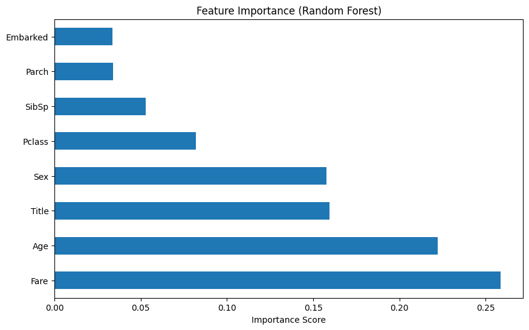

# 🚢 Titanic Survival Prediction

> **Mô tả ngắn:** Dự án Machine Learning phân loại nhị phân (Binary Classification) để dự đoán khả năng sống sót của hành khách trên tàu Titanic, tập trung vào kỹ thuật Feature Engineering và xử lý dữ liệu mất cân bằng.

## 📖 Tổng quan (Overview)

Mục tiêu của dự án là xây dựng một mô hình dự đoán chính xác xem một hành khách có sống sót hay không dựa trên các thông tin cá nhân (Tuổi, Giới tính, Hạng vé, v.v.).

Thay vì chỉ áp dụng thuật toán một cách máy móc, dự án này tập trung sâu vào việc **phân tích dữ liệu (EDA)** và **tạo đặc trưng mới (Feature Engineering)** để cải thiện hiệu suất mô hình, đồng thời giải quyết bài toán Data Leakage.

## 🛠️ Kỹ thuật áp dụng (Key Techniques)

Dự án sử dụng quy trình xử lý dữ liệu và huấn luyện chuẩn:

### 1. Data Cleaning & Imputation
- **Age**: Điền giá trị thiếu bằng trung vị (median) dựa trên nhóm `Pclass`.
- **Embarked**: Điền giá trị thiếu bằng giá trị xuất hiện nhiều nhất (mode).

### 2. Feature Engineering (Điểm nhấn)
Tôi đã tạo ra các đặc trưng mới giúp cải thiện đáng kể độ chính xác so với dữ liệu gốc:
- **Title Extraction**: Trích xuất danh xưng (Mr, Mrs, Miss, Master...) từ cột `Name` để nhóm các hành khách có đặc điểm xã hội tương đồng.
- **FamilySize**: Kết hợp `SibSp` và `Parch` để xác định kích thước gia đình đi cùng (`FamilySize = SibSp + Parch + 1`).

### 3. Machine Learning Models
- **K-Nearest Neighbors (KNN)**: Sử dụng để so sánh hiệu quả khi chưa có và có Scaling dữ liệu.
- **Random Forest Classifier**: Mô hình chính, tận dụng khả năng xử lý dữ liệu phi tuyến tính và cung cấp Feature Importance.

## 📊 Kết quả (Results & Insights)

Dựa trên các thử nghiệm thực tế, dự án đã đạt được những kết quả đáng chú ý:

### 1. Hiệu suất mô hình (Model Performance)
Mô hình **Random Forest** đạt kết quả tốt nhất sau khi đã xử lý dữ liệu:
- **Accuracy**: **82.12%** (Trên tập Test set)
- **Precision (Survived)**: 78%
- **Recall (Survived)**: 78%

**Bảng so sánh quá trình cải thiện:**

| Model / Experiment | Accuracy | Ghi chú |
| :--- | :--- | :--- |
| KNN (Không Scaling) | 70.40% | Kết quả thấp do khoảng cách Euclide bị ảnh hưởng bởi độ lớn giá trị. |
| KNN (Có Scaling) | 79.37% | Tăng gần **9%** chỉ nhờ chuẩn hóa dữ liệu (StandardScaler). |
| KNN (+ Feature Engineering) | **81.17%** | Tăng thêm ~2% nhờ tạo feature `FamilySize` và `Title`. |
| **Random Forest** | **82.12%** | Mô hình tốt nhất hiện tại. |

### 2. Phân tích lỗi (Confusion Matrix)
Kết quả trên tập Test (179 mẫu):
- ✅ **Dự đoán đúng:** 147 trường hợp.
- ⚠️ **Sai sót:** Chỉ có 32 trường hợp dự đoán sai (16 False Positive, 16 False Negative), cho thấy mô hình khá cân bằng giữa việc phát hiện người sống và người mất tích.

### 3. Feature Importance
Biểu đồ từ Random Forest cho thấy **Title (Danh xưng)** và **Sex (Giới tính)** là hai yếu tố quan trọng nhất, khẳng định giả thuyết ban đầu "Lady First" và địa vị xã hội ảnh hưởng lớn đến cơ hội sống sót.

*(Hình ảnh biểu đồ Feature Importance)*

